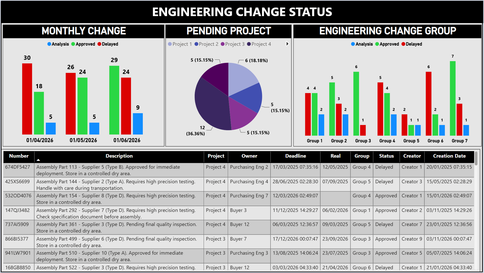

# Engineering Change Pipeline

A Python and SQL pipeline that replaces a manual spreadsheet step between an
engineering change management system and a Power BI report.

I built the original report myself. This repository is the second version of
it: after a few months of running the weekly refresh by hand, the spreadsheet
in the middle had become the part that broke.

> The data here is synthetic. `src/generate_raw.py` builds an export with the
> same structure and the same defects as the real one, so the whole pipeline
> runs on a fresh clone with nothing to download.

---

## What it feeds



This is what the work was for. The pipeline exists so that this report gets
clean tables instead of a spreadsheet somebody maintained by hand every Monday.

The report file itself is not published here — it stays with the company. The
screenshot is the anonymised version of it, rebuilt on synthetic data: every
supplier, owner, project and document number was generated.

The full write-up, with both dashboards and a short recording of each,
is on my portfolio page:
**[Power BI — Engineering Change Tracking](https://app.notion.com/p/lucasnunesf/Power-BI-Engineering-Change-Tracking-3e5917c89c1780978911c01acd0b21b3)**

---

## The problem

The source system tracks engineering change instructions through an approval
workflow. It answers one question well — *what is the status right now* — and
three questions badly:

| Question | Why the source system could not answer it |
|---|---|
| How many changes were late **last month**? | It only ever shows the present state. |
| Is the delay rate getting better or worse? | Same reason: no history is kept. |
| Which group is holding things up? | Group and category are free-text fields. |

The first version filled those gaps with a spreadsheet: export the data, apply
formulas, refresh Power BI. It worked, and it had three problems that got
worse every week.

**The weekly export was manual.** About twenty minutes of downloading, pasting
and dragging formulas down, every Monday, by one person.

**The history was rebuilt wrongly.** The spreadsheet worked out "status on date
X" by taking *today's* status and adjusting it, so a change approved three
weeks late showed up as on time once it closed.

**Nothing checked the data.** Duplicate rows, categories typed four different
ways, and dates stored as text all flowed straight into the report.

---

## What this pipeline does

```
export.xlsx
    │
    │  load_raw.py        read it, change nothing
    ▼
stg_eci_export            the landing table
    │
    │  clean.py           parse dates, fold spellings, remove duplicates
    ▼
clean_eci                 trustworthy rows
    │
    │  build_sql.py       run the files in sql/
    ▼
dim_status, dim_step      lookups
vw_eci_status, vw_...     the business rules
    │
    │  snapshot.py        record where everything stands today
    ▼
fact_status_snapshot      the history the source system never kept
    │
    ▼
Power BI                  connects over ODBC and reads the views
```

One command:

```bash
python src/run_pipeline.py
```

---

## Why Python and SQL, and not one of them

```
PYTHON    makes the data trustworthy
          dates become dates, spellings are folded, duplicates go

SQL       answers business questions
          what counts as late, how many per group, how it looked last month
```

Python is good at reading a messy file and fixing types. SQL is good at
aggregating and joining, and it keeps the rules readable by someone who does
not write Python. A rule change is a change to one `CASE` statement in
`sql/02_views.sql`, not a code review.

---

## What changed, concretely

| | Before | After |
|---|---|---|
| Weekly effort | ~20 min by hand | one command |
| History | rebuilt from today's status | recorded weekly, and derived from the dates |
| Duplicate rows | reached the report | removed, and an assertion fails the run if any survive |
| Category values | 6 spellings of 3 categories | folded into a controlled vocabulary |
| Dates | text in some rows, dates in others | parsed once, explicitly day-first |
| Business rules | nested `IF` in a hidden column | named views, readable without opening Python |

### Rebuilding history from the dates

The rule that mattered most. A step's status on any past date comes from two
dates the row already carries:

```python
if completed_at is not None and completed_at <= as_of:
    return "Approved"
if deadline is not None and deadline < as_of:
    return "Delayed"
```

This gives the same answer for a given date no matter when the pipeline runs,
which the spreadsheet version did not.

### Why snapshots are still needed

Deriving from dates covers everything except a value that was *changed*. When a
deadline is pushed from March to June, the source system keeps only the new
one, and any reconstruction now believes the change was always due in June.
`fact_status_snapshot` keeps the real before-and-after, and
`vw_status_changes` reports what moved between one week and the next.

---

## Running it

```bash
git clone https://github.com/lucasnunesf/pipeline-eng-change-powerbi
cd pipeline-eng-change-powerbi
pip install -r requirements.txt

python src/run_pipeline.py --fresh
```

`--fresh` rebuilds the database from nothing and seeds twelve weeks of history,
so the trend views have something in them. After that, the weekly run is:

```bash
python src/run_pipeline.py
```

Each step also runs on its own, which is useful while a rule is being changed:

```bash
python src/generate_raw.py     # build the synthetic export
python src/load_raw.py         # land it, untouched
python src/clean.py            # clean and deduplicate
python src/build_sql.py        # run the sql files
python src/snapshot.py         # record today
```

---

## Layout

```
src/generate_raw.py    builds the synthetic export, defects included
src/load_raw.py        loads it into the staging table, unchanged
src/clean.py           parsing, spelling, deduplication
src/build_sql.py       runs the .sql files in order
src/snapshot.py        writes one row per document per week
src/run_pipeline.py    the order, and stops on the first failure

sql/01_dimensions.sql  status and step lookup tables
sql/02_views.sql       the status rules and the reporting views
sql/03_history.sql     the snapshot table and the trend views
```

---

## What the report reads

| View | Holds |
|---|---|
| `vw_eci_status` | one row per change, with its current status |
| `vw_status_by_group` | counts per group and status |
| `vw_status_by_vehicle` | counts per vehicle and status |
| `vw_on_time_by_step` | how well each workflow step keeps its deadlines |
| `vw_status_history` | the status mix on each snapshot date |
| `vw_status_changes` | which changes moved status, and from what |
| `vw_weekly_movement` | a count of those movements per week |

---

## Notes

**Dates are parsed day-first on purpose.** The source writes `dd/mm/yyyy`, and
letting a parser guess gets 05/09 wrong half the time — silently, because the
report still renders.

**Unmapped values are kept, not dropped.** A category with no entry in
`clean.py`'s mapping passes through as it arrived and shows up in the run's
summary. A pipeline that quietly loses rows is harder to trust than one that
complains.

**The database is not in this repository.** `.gitignore` blocks `*.xlsx`,
`*.db` and `*.pbix`. What is version-controlled is what *produces* the data, so
a clone reproduces the same database rather than downloading a copy of it.

**`fact_status_snapshot` is the one table that is never dropped.** Every other
table and view is rebuilt on each run. Dropping that one would throw away the
history, which is the whole point of it.
